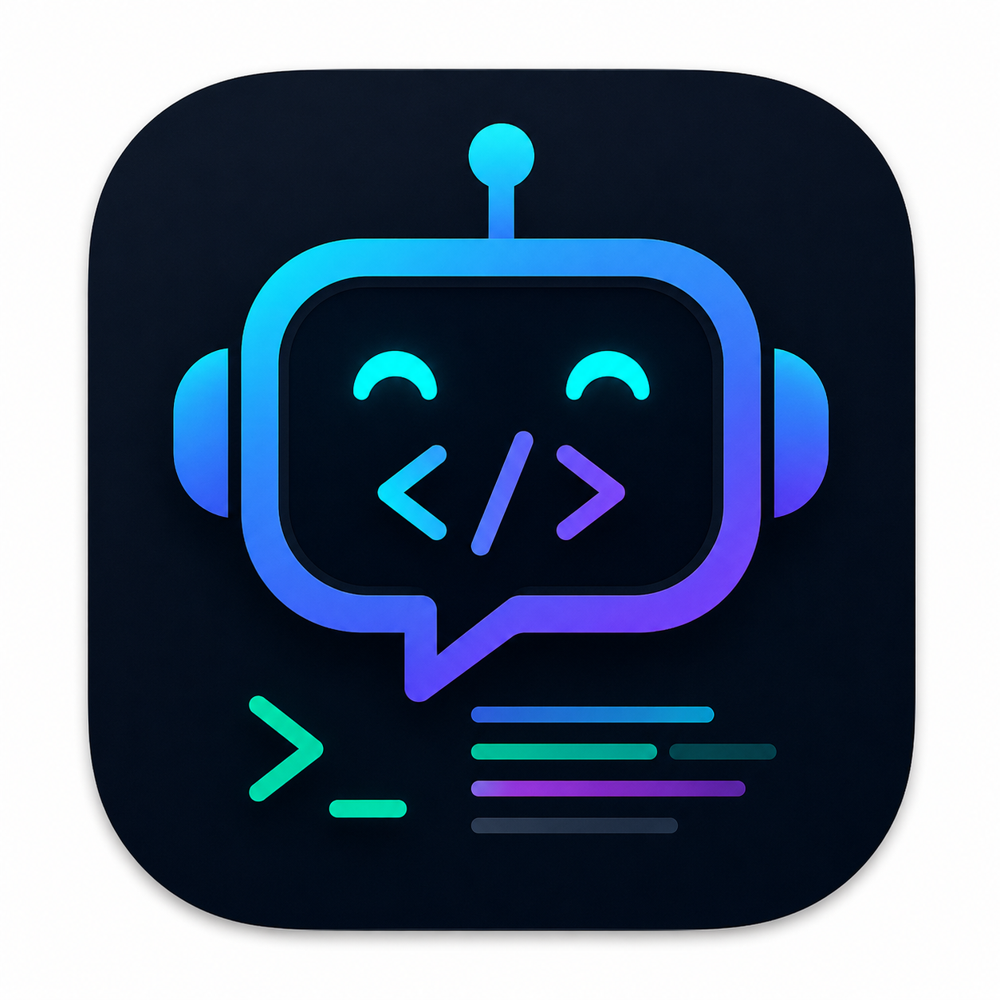

# Local Coding Assistant

MCP tools for VS Code-compatible clients


## Architecture

```text
VS Code / MCP Client
    ↓
mcp_server.py
    ↓
server.py
    ↓
Ollama + project files you explicitly read/provide
```

## Environment

Create a `.env` file:

```bash
PROJECT_ROOT=/absolute/path/to/your/project
OLLAMA_BASE_URL=http://127.0.0.1:11434
OLLAMA_MODEL=qwen3
```

`PROJECT_ROOT` is the root of your programming project.

## Install
- Make Sure your terminal is running in Conda Environment
```bash
pip install -r requirements.txt
```

## Run Ollama

```bash
brew services start ollama
ollama pull qwen3
```

## Start the API server
- Make Sure your terminal is running in Conda Environment
```bash
uvicorn server:app --reload --port 8000
```

Open:

```text
http://127.0.0.1:8000/docs
```

## Start the MCP server
- Make Sure your terminal is running in Conda Environment
In another terminal:

```bash
python mcp_server.py
```
## Install and Configure Continue in VSCODE
Continue can be configured to use Ollama with:
```ymal
name: Local Config
version: 1.0.0
schema: v1

models:
  - name: Qwen3
    provider: ollama
    model: qwen3
```
That tells Continue:
```text
Use local Ollama at localhost:11434
```
Continue will act as MCP Client that talks to mcp_server.py

mcp_server.py calls:
server.py at http://127.0.0.1:8000/search

## Tools

```text
ask_ai
list_project_files
read_project_file
write_project_file
run_project_command
```

## Example prompts

```text
List files in modules/custom.
Read modules/custom/example/example.module and explain it.
Ask AI to refactor this file using context_files=["modules/custom/example/example.module"].
Run drush cr.
Run composer validate.
```

# License

MIT License

Copyright (c) 2026 John Paul Mariano

See the LICENSE file for full license text.
